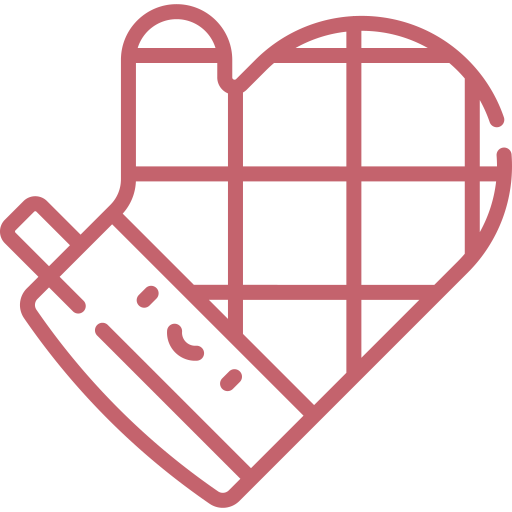

### Hi, I'm Mireia ✦

**Fullstack Developer · Angular & Node.js · Open to work**

Junior developer with experience in fintech environments. I build web apps end-to-end — from Angular UIs to RESTful APIs — and I'm always learning something new.

---

**Stack**

---
**Featured project —  Cookee**

Social recipe-sharing network built fullstack from scratch.

- Angular + Node.js + Express + MongoDB Atlas
- JWT authentication · Cloudinary for image upload
- Deployed on Vercel (frontend) & Railway (backend)

🔗 [github.com/MariaMunozDeveloper](https://github.com/MariaMunozDeveloper)

---
🌐 [mariamunozdeveloper.github.io/portfolio](https://mariamunozdeveloper.github.io/portfolio/)

---
**Stats**

---

 Valencia, Spain ·  Open to frontend, backend or fullstack roles · [LinkedIn](https://www.linkedin.com/in/maria-munoz-ferrer/)
